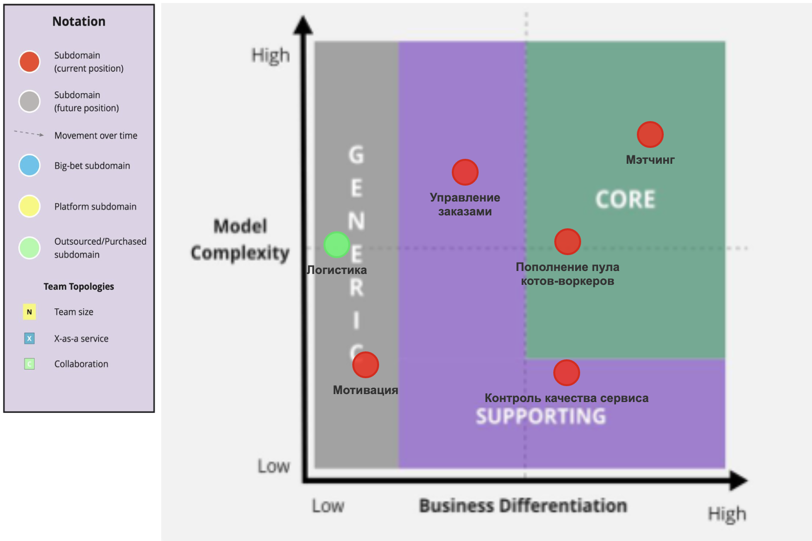
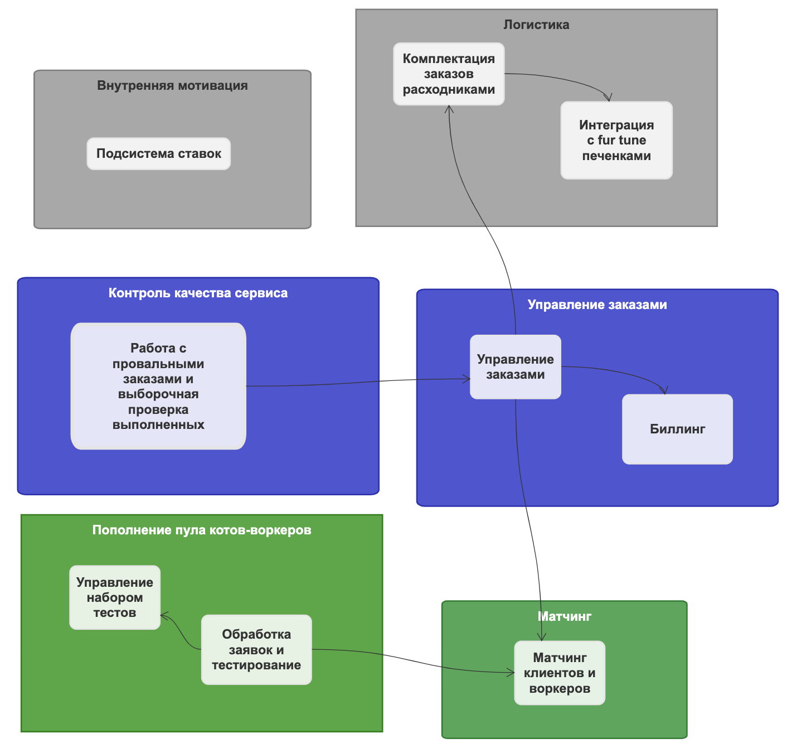
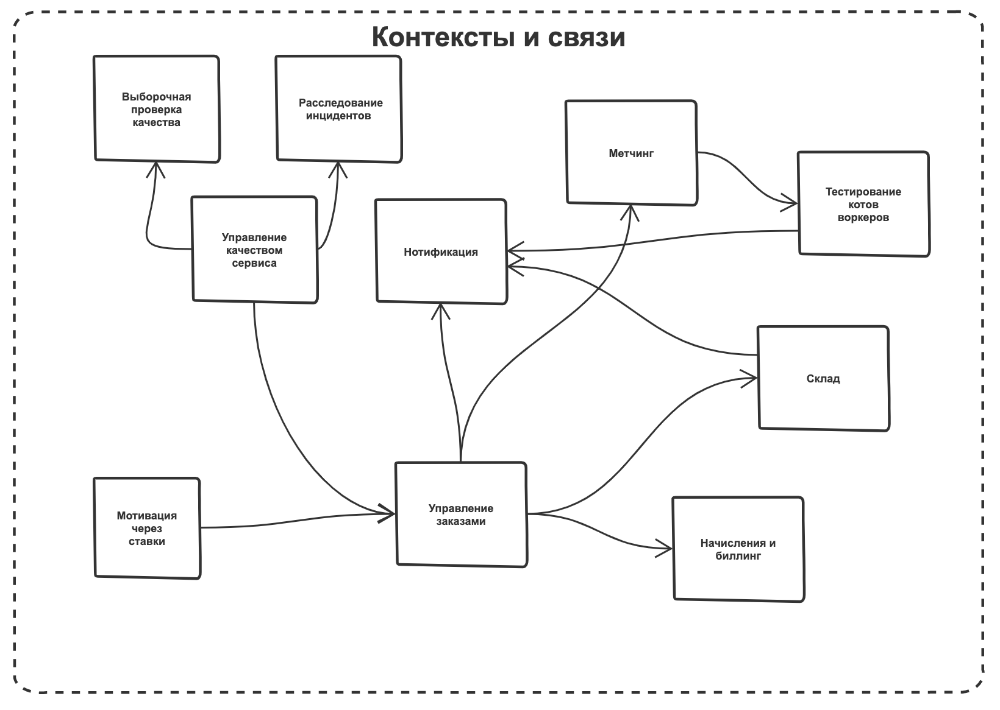

## 1. Выпишите все поддомены, которые вы нашли в системе

### Критерии  
| **Вид поддомена** | **Есть ли конкурентное преимущество** | **Сложность реализации**             | **Варианты реализации**                                | **Изменчивость** | **Интерес решения проблемы** |
|-------------------|---------------------------------------|--------------------------------------|--------------------------------------------------------|------------------|------------------------------|
| core              | да                                    | высокая                              | инхаус-разработка                                      | частая           | высокий                      |
| generic           | нет                                   | может быть как высокой, так и низкой | покупается, аутсорс, no-code, инхаус слабыми командами | редкая           | низкий, есть решения         |
| supporting        | нет                                   | низкая                               | инхаус, аутсорс, no-code                               | редкая           | низкий, есть решения         |

### Проекция домена Make Cats Free again на поддомены в разрезе core/supporting/generic
| **Вид поддомена**              | **Конкурентное преимущество/тип поддомена** | **Сложность** | **Изменчивость** | **Варианты реализации**                          | **Интерес проблемы** | **Комментарий**                                                                                                                                                                                                                                                                                                                       |
|--------------------------------|---------------------------------------------|---------------|------------------|--------------------------------------------------|----------------------|---------------------------------------------------------------------------------------------------------------------------------------------------------------------------------------------------------------------------------------------------------------------------------------------------------------------------------------|
| Управление заказами            | нет / supporting                            | высокая       | высокая          | Собственная разработка или покупка конструктора  | средний              |                                                                                                                                                                                                                                                                                                                                       |
| Контроль качества сервиса      | нет / supporting                            | низкая        | редкая           | Собственная разработка                           | низкий               |                                                                                                                                                                                                                                                                                                                                       |
| Метчинг клиентов и воркеров    | да  / core                                  | высокая       | частая           | Собственная разработка                           | высокий              |                                                                                                                                                                                                                                                                                                                                       |
| Пополнение пула котов-воркеров | да  / core                                  | высокая       | частая           | Собственная разработка                           | высокий              | Можно было отнести в supporting, но здесь дело в том, что процесс матчинга очень сильно завязан на качество данных, которые мы получаем от процесса приема новых воркеров. Плюс есть требование, что для бизнеса критично проверять новые гипотезы по отсеву котов и изменять уже существующие с максимальной скоростью и надёжностью |
| Логистика                      | нет / generic                               | низкая        | редкая           | Купить готовый сервис                            | низкий               |                                                                                                                                                                                                                                                                                                                                       |
| Внутренняя мотивация           | нет / generic                               | низкая        | редкая           | Собственная разработка                           | низкий               |

## 2. Определите все типы поддоменов и заполните core domain chart

## 3. определите боундед-контексты для каждого из поддоменов, основываясь на требованиях (хватит одной модели, как было в уроке)

## 4. Cравните полученные боундед-контексты из поддоменов и боундед-контексты, полученные из ES.   
Опишите, что разошлось (можно показать на картинке в сравнении) и предположения, почему так получилось
  

### Рефлексия по поводу изменения ограниченных контекстов из DDD и ES первой версии  
1. Выделение матчинга в отдельный BC. Скорее всего в первой версии он слился с управлением заказами из-за незнания автором DDD.  
2. Упразднение отдельного BC по нотификации. Тоже от незнания DDD и акцента на технической реализации вместо бизнес-команд.  
3. Упрощение контроля качества - в новой версии это один BC. Тоже под влиянием DDD. 

## 5. Cделайте исправленную версию ES-модели и модели данных, если боундед-контексты разошлись. 
Если не разошлись — приложите ES и модель данных из прошлого урока;  
если нашли места, где бизнес-команда разбилась на технические шаги, — отметьте эти места на модели;  
[Исправленная версия ES](https://sketchboard.me/XDPdYWruFRCX#/)  
 - Убрал полностью нотификации  
 - Слил технические шаги в биллинге
 - Выстроил в длинную колбасу тестирование котов на роль воркеров отражая temporal coupling  

[Модель данных](https://sketchboard.me/BDOAlRSSrueE#/)

## 6. выпишите характеристики, важные для проекта.  
В нашем случае мы не можем спросить у бизнеса, что важно, а что нет;
для каждой найденной характеристики укажите место, где она была взята;

### Памятка по характеристикам  
| **Характеристика**                              | **Краткое описание**                                                                                                                                          |
|-------------------------------------------------|---------------------------------------------------------------------------------------------------------------------------------------------------------------|
| Availability                                    | Измеряет отказы системы и их последствия                                                                                                                      |
| Scalability                                     | Насколько система справляется с ростом нагрузки                                                                                                               |
| Modifiability                                   | Цена и риски изменений системы                                                                                                                                |
| Maintainability                                 | Ремонтопригодность — сложность восстановления системы после поломок или изменения других характеристик                                                        |
| Securability (чаще встречается термин security) | Насколько система защищает информацию от несанкционированного доступа                                                                                         |
| Performance                                     | Время, за которое система реагирует на действия пользователей или других систем                                                                               |
| Agility                                         | Составная характеристика, которая обозначает «гибкость» системы — умение подстраиваться под изменения во внешнем мире                                         |
| Testability                                     | Характеризует простоту или полноту тестирования                                                                                                               |
| Deployability                                   | Измеряет простоту и скорость деплоймента новой функциональности                                                                                               |
| Usability                                       | Характеризует эффективность и удобство взаимодействия людей с системой                                                                                        |
| Consistency                                     | Насколько система гарантирует возвращение актуального состояния после каждого чтения. Это когда все пользователи видят одинаковые данные в одно и то же время |

### Анализ требований по характеристикам  
| **Требование**                                                                                                                        | **Мапинг на quality attributes**          | **Комментарий**                                             | **Sub-domain**              |
|---------------------------------------------------------------------------------------------------------------------------------------|-------------------------------------------|-------------------------------------------------------------|-----------------------------|
| Мы ожидаем 1 к заявок в день от рандомных котов, также, судя по отзывам, наши конкуренты могут попытаться нас заддосить в этом месте. | Scalability, Performance, Maintainability |                                                             | Тестирование котов-воркеров |
| Ставки  могут делать только менеджеры, которых будет не больше 15                                                                     | Scalability                               | Косвенно говорит об объёме нагрузки на подсистему мотивации | Внутренняя мотивация        |
| Бизнесу необходим низкий ТТМ (Time To Market), чтобы конкурировать на рынке.                                                          | Agility, Testability, Deployability       | низкий TTM                                                  | вся система                 |
| Общая нагрузка на систему не будет превышать 10 заказов в день и 100 клиентов. Воркеров будет 20 человек                              | Scalability, Performance                  | невысокая нагрузка                                          | вся система                 |
| Для бизнеса критично проверять новые гипотезы по отсеву котов и изменять уже существующие с максимальной скоростью и надёжностью.     | Evolvability                              | Адаптация                                                   | Core поддомен               |

Таким образом в сухом отстатке имеем:
 - Относительно низкая планируемая нагрузка на систему, нет вводных по росту нагрузки (**Performance**, **Scalability**)
 - Низкий TTM (**Agility**, **Testability**, **Deployability**)
 - **Scalability**, **Modifiability**, **Maintainability**, **Testability**, **Agility**, **Evolvability** важны ибо система на нулевом цикле разработки.

## 7. Выберите один из четырёх архитектурных стилей, описанных в уроке.  
Опишите, почему вы сделали такой выбор и по каким характеристикам сравнивали стили (можно использовать картинку из урока со сравнением стилей);

По набору характеристик подходят микросервисы и service-based архитектура (невысокие требования к performance, scalability, низкий TTM, Evolvability).
Микросервисы хороши всем, кроме производительности(performance) и цены(cost). 
По сути оба архитектурных стиля будут равнозначны и ввиду отсутствия вводых по тому, что важнее TTM или cost, можно остановиться на service-based, т.к. стоимость значительно ниже, а Evolvability с другими(типа Modifiability, Maintainability) не так драматично меньше, как cost.

## 8. Cделайте итоговую модель системы, укажите виды коммуникаций между элементами, если выбрали распределённый стиль.

