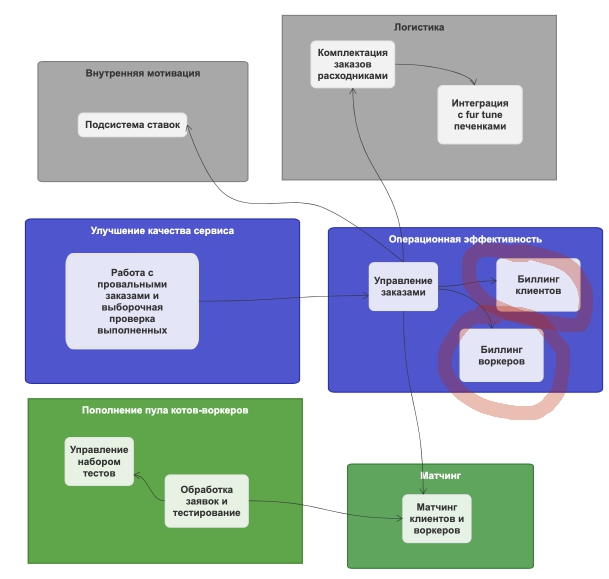

# 1. Анализ стейкхолдеров их запросов/хотелок/болей (в уроке это называется _concerns_)
попробуйте расписать стейкхолдеров по группам из урока. Попутно пофантазируете, кого потенциально мы забыли указать в списке стейкхолдеров;

| **Стейкхолдеры** | **И что их беспокоит**                                                                                                                                                                                                                                                                                                                                                                                                   |
|------------------|--------------------------------------------------------------------------------------------------------------------------------------------------------------------------------------------------------------------------------------------------------------------------------------------------------------------------------------------------------------------------------------------------------------------------|
| Топы             | скоринг потенциальных работников уникален в своём роде, и логика его работы сильно выше, чем планировалось. Бизнес в будущем хочет продавать его другим компаниям и тестировать больше гипотез;  релизный цикл для всей системы — месяц, для скоринга работников — неделя максимум.                                                                                                                                      |
| Менеджеры        | хотят, чтобы о системе ставок не знали другие отделы, иначе будет некрасивая ситуация. Они хотят скрыть эту систему даже от разработчиков, которые не будут ей заниматься, и от начальства;выяснилось, что котам из Happy Cat Box наш проект понравился, поэтому приходит не 10 заказов в день, а 10 заказов в минуту.                                                                                                   |
| Клиенты          | ожидаемое поведение системы: без сбоев и тупняков.                                                                                                                                                                                                                                                                                                                                                                       |
| Воркеры          | прозрачность начислений; работа склада без сбоев и тупняков                                                                                                                                                                                                                                                                                                                                                              |
| Разработчики     | система должна работать без сбоев, а если сбой случается, то должно быть понятно, что и где чинить                                                                                                                                                                                                                                                                                                                       |
| Финотдел         | списывать деньги с клиентов каждую неделю слишком затратно для отдела, поэтому они хотят списывать деньги раз в месяц, но платить воркерам и дальше раз в неделю. При этом необходимо постоянно добавлять новые способы списания денег для клиентов. Воркеры всегда работают через компанию «Золотая шляпа»; боятся потерять любую финансовую информацию и хотят решение, которое будет гарантировать, что всё будет ок. |
| Юристы           | соответствие всей системы правовым нормам.                                                                                                                                                                                                                                                                                                                                                                               |
| Админы           | простота мониторинга системы для своевременного замечания сбоев, чтобы не работать в авральном режиме                                                                                                                                                                                                                                                                                                                    |
| Склад            | какие-то и у них есть хотелки/боли                                                                                                                                                                                                                                                                                                                                                                                       |

Что еще может быть в части внешних ограничений - интеграция с золотой шляпой может накладывать ограничения в части выбора технологий.

## Выбор архитектурного стиля

выберите один из семи архитектурных стилей, описанных в уроке. Опишите, почему вы сделали такой выбор и по каким критериям сравнивали стили (можно использовать картинку из урока со сравнением стилей); если выбрали распределённый архитектурный стиль, опишите, какие сервисы будут отдельно, и объясните, почему каждый из сервисов должен быть отдельно от остальных;

Напомним итоговую модель системы из предыдущего урока   

Однако после анализа новых вводных есть необходимость разделить биллинги - у них разные характиристики в части Modifiability, Evolvability  
`При этом необходимо постоянно добавлять новые способы списания денег для клиентов.`  
Так же этим разделением на два отдельных bounded контекста мы исправляем обишку предудущей домашки.  
Измененная модель системы с новыми bounded контекстами.  

Таблица сравнения архитектурныйх стилей  

| **Bounded Context**                                             | **Concerns/Характеристики/внешние ограничения**                                                                                                                                                                                                                                  | **Рассуждение**                                                                                                                                                                                                                                                                                                                                                                                                                                                                                    | **Архитектурный стиль **  |
|-----------------------------------------------------------------|----------------------------------------------------------------------------------------------------------------------------------------------------------------------------------------------------------------------------------------------------------------------------------|----------------------------------------------------------------------------------------------------------------------------------------------------------------------------------------------------------------------------------------------------------------------------------------------------------------------------------------------------------------------------------------------------------------------------------------------------------------------------------------------------|---------------------------|
| Матчинг клиентов и воркеров                                     | Скоринг потенциальных работников уникален в своём роде, и логика его работы сильно выше, чем планировалось. Отдельный релизный цикл - много меньше, чем для всей системы; потенциально отдельный сервис с большой нагрузкой                                                      | Требуются Scalability, Modifiability, Agility, Deployability. Этот поддомен/контекст из области data science/data engineering. Как правило весь процесс разбивается на различные шаги по подготовке данных и скорингу.  По характиристикам больше подходит microservices (но я мог ошибится в определении характеристик - это один из самых сложных аспектов). Однако в пользу pipeline говорит и то, что в требованиях упоминается схожесть с map-reduce - а это прямая отсылка к pipeline стилю. | Pipeline                  |
| Обработка заявок и тестирование                                 | Configurability, Evolvability, Modifiability. Небольшая нагрузка - всего 1К заявок в день.                                                                                                                                                                                       | Здесь так же есть отсылка к пошаговому бизнес-процессу обработки заявок + невысокая нагрузка                                                                                                                                                                                                                                                                                                                                                                                                       | Pipeline                  |
| Управление набором тестов                                       | Для бизнеса критично проверять новые гипотезы по отсеву котов и изменять уже существующие с максимальной скоростью и надёжностью. Отсюда получаем Deployability, Agility, Evolvability, Reliability.                                                                             | Cудя по характеристикам подойдет microkernel                                                                                                                                                                                                                                                                                                                                                                                                                                                       | Microkernel               |
| Работа с провальными  заказам и выборочная проверка выполненных |                                                                                                                                                                                                                                                                                  | Очень простая система - набор CRUD-ов для работы с инцидентами                                                                                                                                                                                                                                                                                                                                                                                                                                     | Monolith                  |
| Управление заказами                                             | выяснилось, что котам из Happy Cat Box наш проект понравился, поэтому приходит не 10 заказов в день, а 10 заказов в минуту. От клиентов : ожидаемое поведение системы: без сбоев и тупняков. Scalability, Elasticity.                                                            | Должно бесконечно масштабироваться - тут вроде бы все очевидно.                                                                                                                                                                                                                                                                                                                                                                                                                                    | EDA                       |
| Биллинг клиентов                                                | При этом необходимо постоянно добавлять новые способы списания денег для клиентов. боятся потерять любую финансовую информацию и хотят решение, которое будет гарантировать, что всё будет ок.  Evolvability, Consistency, Reliability, Modifiability, Testability, Adaptability | Пдойдет монолит с максимальной характеристикой по Modifiability и Testability.                                                                                                                                                                                                                                                                                                                                                                                                                     | Microkernel или Pipeline  |
| Биллинг воркеров                                                | То же самое, что и биллинг клиентов                                                                                                                                                                                                                                              |                                                                                                                                                                                                                                                                                                                                                                                                                                                                                                    | Microkernel или Pipeline  |
| Подсистема ставок                                               | хотят, чтобы о системе ставок не знали другие отделы, иначе будет некрасивая ситуация. Они хотят скрыть эту систему даже от разработчиков, которые не будут ей заниматься, и от начальства;                                                                                      | Самая простая система - подойдет что угодно - хоть скрипт, который по крону запускается                                                                                                                                                                                                                                                                                                                                                                                                            | Слоеный монолит           |
| Комплектация заказов расходниками                               |                                                                                                                                                                                                                                                                                  | Никаких особенных характеристик не нашлось. Из общих соображений кажется, что здесь может быть важно Evolvability, Modifiability, Reliability, Consistency. Две первые характеристики от всей системы, а две последние - так как это все-таки учет и результат влияет на биллинг.                                                                                                                                                                                                                  | Модульный монолит.        |

## Выбор типов баз данных 

выберите нужный вид баз данных для каждого из полученных сервисов.  
Если у вас получился один монолит — определите необходимый вид базы для этого монолита.   
Опишите, почему вы сделали такой выбор и какие критерии использовали для выбора;

| **Bounded Context**                                             | **Вид БД**     | **Рассуждение **                                                                                                           | **undefined** |
|-----------------------------------------------------------------|----------------|----------------------------------------------------------------------------------------------------------------------------|---------------|
| Матчинг клиентов и воркеров                                     | RDBMS          | Поровну чтения и записи (первичные признаки и генерация фичей), будут нунжны join-ы                                        |               |
| Обработка заявок и тестирование                                 | RDBMS/Document | С одной стороны кажется, что это набор CRUD-ов, а с другой, может быть какие-то полнотекстовые документы будут храниться   |               |
| Управление набором тестов                                       | RDBMS/Document | Тоже, что и выше                                                                                                           |               |
| Работа с провальными  заказам и выборочная проверка выполненных | RDBMS          | Тоже, что и выше                                                                                                           |               |
| Управление заказами                                             | RDBMS          | Тоже, что и выше                                                                                                           |               |
| Биллинг клиентов                                                | RDBMS          |  + нужна высокая консистентность                                                                                           |               |
| Биллинг воркеров                                                | RDBMS          |  + нужна высокая консистентность                                                                                           |               |
| Подсистема ставок                                               | RDBMS          |                                                                                                                            |               |
| Комплектация заказов расходниками                               | RDBMS          |  + нужна высокая консистентность                                                                                           |               |

## Стили коммуникаций  

выберите нужный стиль коммуникаций и их вид (синхронный/асинхронный).  
Опишите, почему вы сделали такой выбор и какие критерии использовали для выбора;  

- **Request-response** — это когда отправляется реквест на выполнение действия, а после ожидается ответ с результатом.  
- **Event-driven** — это когда продьюсится техническое событие, а дальше все консьюмеры на него реагируют. Важно, что события, используемые в event-driven-подходе, говорят о том, что в мире что-то произошло, а не о действии, которое необходимо совершить консьюмерам. Это Ибрагиму объяснили попуги на курсе «Асинхронная архитектура».  
- **Common data** — это когда элементы вместо вызова друг друга используют общее хранилище данных. Может быть общая база данных или файл в системе.  

Считается, что синхронные коммуникации подходят в трёх случаях:
1. Нужно как можно быстрее отправить текущее состояние данных в другое место.
2. Когда состояние данных должно быть актуально в другом месте.
3. Есть сервисы, которым нужно быстро получать ответы от второго сервиса.

А асинхронные коммуникации нужны, когда:
1. Данные не обязательно получать моментально.
2. Существует большой поток данных для обработки, а обработка должна контролироваться по нагрузке.
3. Нужно одни и те же данные отправить в несколько мест одновременно.

| **Система 1**                                                   | **Система 2**                     | **Рассуждение**                                                                             | **Тип коммуникации**       |
|-----------------------------------------------------------------|-----------------------------------|---------------------------------------------------------------------------------------------|----------------------------|
| Управление заказами                                             | Матчинг клиентов и воркеров       | Подбор может занимать много времени, не требуется мгновенный ответ, бизнес-события и данные | Асинхронные, ED            |
| Обработка заявок и тестирование                                 | Матчинг клиентов и воркеров       | Стриминг по данным, бизнес-события, не требуется мгновенный ответ                           | Асинхронные, ED            |
| Обработка заявок и тестирование                                 | Управление набором тестов         | Нет необходимости в асинхронности и в response-request                                      | Common data                |
| Работа с провальными  заказам и выборочная проверка выполненных | Управление заказами               | Стриминг по данным, не требуется мгновенный ответ                                           | Асинхронные, ED            |
| Управление заказами                                             | Подсистема ставок                 | Просто надо читать данные по заказам                                                        | Common data                |
| Управление заказами                                             | Комплектация заказов расходниками | Бизнес-событие                                                                              | синхронный request-response|

## Верификация
предположите, какие фитнес-функции можно использовать для валидации итоговой системы.  
Можете считать, что система будет делаться с использованием любого языка программирования, следовательно, можете выбрать любые инструменты из любой экосистемы;

1. Для всего - code coverage - Testability
2. Для биллингов - consistency - кастомный набор data quality проверок
3. Управление заказами - Scalability/Performance - нагрузочное тестирование - Yandex Tank
4. Low TTM для Мэтчинга - настроим автоматическую проверку по частоте релизов
5. Для всего - соответствие архитектурному стилю - ревью технической спецификации + демо при завершении каждого спринта
6. Для всего - Maintanability - сделаем какой-нибудь step в пайплайне CI/CD, например, линтер на проверку комментариев 
7. Там, где есть Deployability/Testability - наличие CI/CD пайплайна

## ADR для подсистемы мэтчинга

**Title** 
ADR-01 по подсистеме метчинга для MCF

**Context**
Алгоритм матчинга — общий для любых образцов, состоит из набора шагов, по которым рассчитываются рейтинги и другие значения.  
Система чем-то похожа на map-reduce. Разработчики решили, что они сами будут реализовывать всю логику на любом языке, так как они не хотят делиться алгоритмом.  
Наша цель — использовать реализованные шаги в нужной нам последовательности, которая иногда может изменяться, при этом необходимо иметь возможность добавлять или редактировать шаги, как нам это необходимо.

Предметная область метчинга - это машинное обучение. В основном процессы ML строятся на базе архитектурного стиля piplines с шагами в виде обработки данных для подговки фичей для ML-моделей.  Для данной области хорошо работают инструменты MLOps - они покрывают все этапы жизненного цикла ML-моделей - от experiment tracking до вывода моделей в прод и позволяют выстраивать пайплайны обработки данных/применения моделей. 
Построение подсистемы матчинга на базе фреймворка MLOps позволит снизить наши затраты и обеспечит достижение всех арактеристик Evolvability, Deployability, Modularity, Workflow.    

**Decision**  
Будем использовать ClearML - это признанный лидер в MLOps, open-source, у него очень большое и живое community, содержит механизм настраиваемых пайплайнов, очень хорошо масштабируется в части deployment-a моделей.

**Consequences**  
Нужно отправить команду разработчиков на обучение ClearML. 

**Сompliance**  
Ручная проверка реализации подсистемы через MLOps

**Alternatives**  
MLFlow

