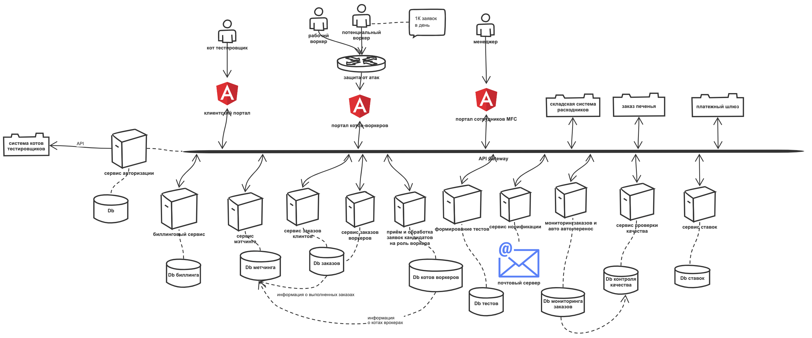
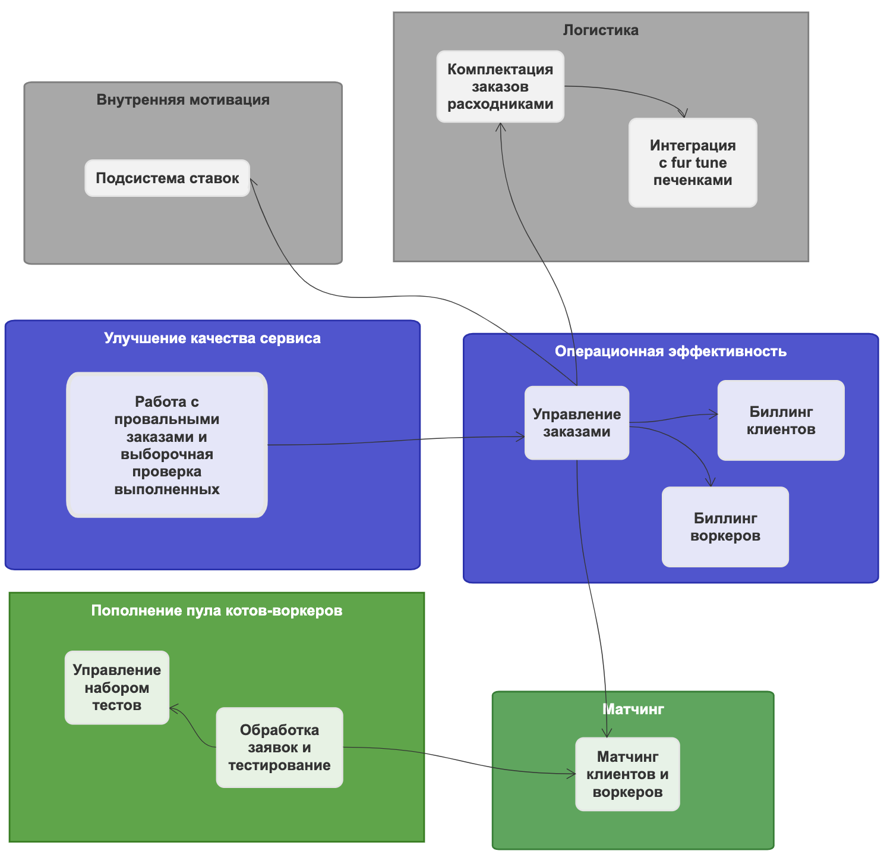

# Задание на 4-ый урок

- для каждого сервиса который добавится или удалится и связанных с ним сервисов посчитайте значение instability;
- опишите, какие сервисы и боундед-контексты в каком месте и каким образом будут меняться;
- спланируйте, как и в какой последовательности будет происходить работа. Можете выбрать одно из двух условий: нет людей, нет ресурсов.

# Контекст решения

## Нулевая домашка
Так уж получилось, что я сделал нулевую домашку.  [Ссылка](https://sketchboard.me/rDOqxSLLGOC) на нулевую домашку.  

## Итоговая система
Итоговая модель системы, как она получилась у меня.  

## Предварительное сравнение