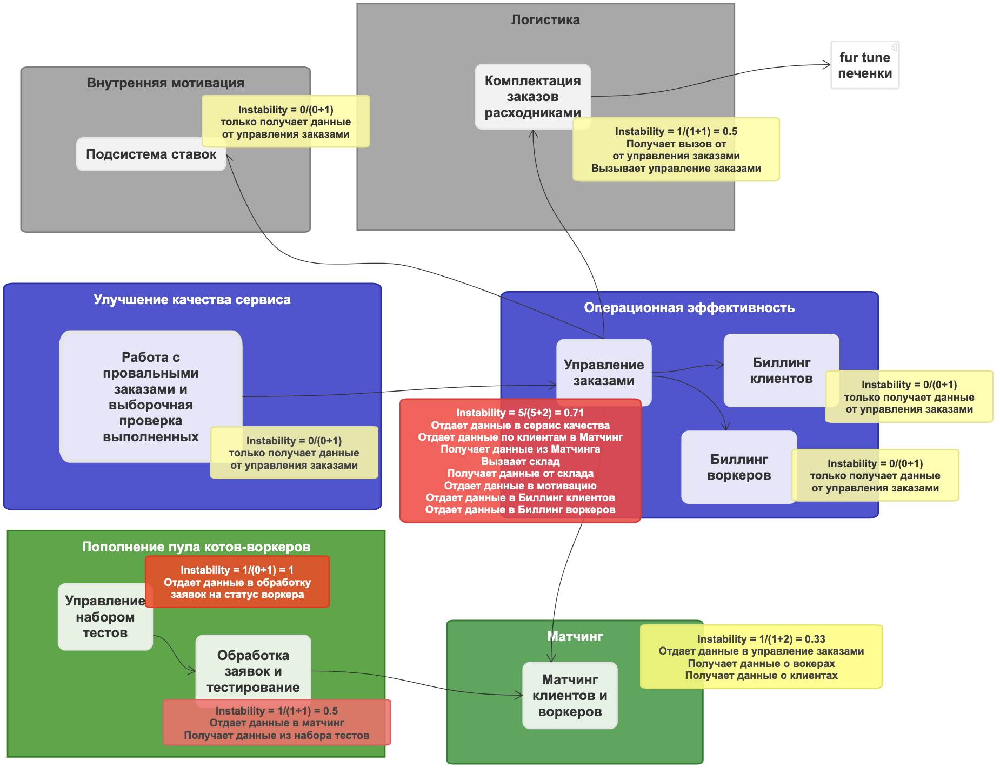

# Задание на 4-ый урок

- для каждого сервиса который добавится или удалится и связанных с ним сервисов посчитайте значение instability;
- опишите, какие сервисы и боундед-контексты в каком месте и каким образом будут меняться;
- спланируйте, как и в какой последовательности будет происходить работа. Можете выбрать одно из двух условий: нет людей, нет ресурсов.

# Контекст решения

## Нулевая домашка
Так уж получилось, что я сделал нулевую домашку.  [Ссылка](https://sketchboard.me/rDOqxSLLGOC) на нулевую домашку.  

## Итоговая система
Итоговая модель системы, как она получилась у меня.  

## Предварительное сравнение

| **Старый BC**                                         | **Новый BC**                                                    | **Комментарий**                                                                                                                    |
|-------------------------------------------------------|-----------------------------------------------------------------|------------------------------------------------------------------------------------------------------------------------------------|
| Сервис метчинга                                       | Матчинг клиентов и воркеров                                     | все шоколадно                                                                                                                      |
| Прием и обработка заявок  кандидатов на роль воркеров | Обработка заявок и тестирование                                 | без изменений                                                                                                                      |
| Формирование тестов                                   | Управление набором тестов                                       | попали в цель                                                                                                                      |
| Сервис проверки качества                              | Работа с провальными  заказам и выборочная проверка выполненных | мастерство не пропьешь                                                                                                             |
| Сервис заказов клиентов                               | Управление заказами                                             | Уже не помню, что мной двигало, когда разносил заказы клиентов и воркеров в разные сервисы - возможно вошел в микросервисный раж   |
| Сервис заказов воркеров                               | Управление заказами                                             | Сливаем два сервиса а один                                                                                                         |
| Биллинговый сервис                                    | Биллинг клиентов                                                | Разделяем биллинг на 2 части                                                                                                       |
| Биллинговый сервис                                    | Биллинг воркеров                                                |                                                                                                                                    |
| Сервис ставок                                         | Подсистема ставок                                               | Бинго                                                                                                                              |
| Внешняя складская система                             | Комплектация заказов расходниками                               | Трактовал скалд, как внешнюю систему. Просто делаем отдельный сервис                                                               |
| Сервис авторизации                                    | -                                                               | Техническая штука - никак не влияет на систему                                                                                     |
| Сервис нотификации                                    | -                                                               | Вносим в  существующие BC                                                                                                          |
| Мониторинг заказов и автоперенос                      | -                                                               | Аналогично нотификации                                                                                                             |

## Итого имеем
1. Общий биллинг разделяется на 2 BC - Биллинг клиентов и Биллинг воркеров
2. Сливаются в один сервис - заказы Клиентов и Воркеров
3. Два сервиса становятся частями других BC - Нотификация и Мониторинг и автоперенос заказов

## Запутанный Instability
Пример нестабильного сервиса - Entity сервисы - источник правды по каким-то данным. Если поменяется энтити-сервис, то все, кто им пользуется будут в зоне риска.  
**Нестабильность** максимальна = 1, когда сервис только отдает данные и только просит другие сервисы для него что-то сделать.  
**Нестабильность** минимальна = 0, когда сервис никого ни о чем не просит и никому ничего не отдает или это сервис-черная дыра. Может показаться, что тогда в сервсе нету никакой пользы, но это не так.  

## Как будем менять систему  
Мой случай не самый интересный, т.к. это не прямой распил монолита, а небольшая доработка микросервисной архитектуры, но все же.  
В моем случае релевантен втрой кейс, когда опыт и инфраструктура есть, а людей и ресурса нет.  
Начинаем с того, что принесёт максимальный эффект при минимальных усилиях:
1. Сливаем в один сервис - заказы Клиентов и Воркеров. Это упростит систему за счет снижения каплинга.
2. Разделяем биллинг на два по той же причине выше.
3. На закуску оставляем технический шаг - внедрение мониторинга и нотификации в соответствующие BC.

@Антон Давыдов/Ибрагим и команда школы сильных программистов: невероятно глубокий и мега-полезный курс, очень качественный материал, захватывающая подача, титанический труд.  
Огромное спасибо всем, кто потрудился над этим - сделано с душой и заботой о нервах простых и не очень программистов =)
made on Earth by humans, как пишут на некоторых продуктах Tesla.  
В знак благодарности - [залипательное](https://vimeo.com/33516816) видео с острова Баффинова земля.  
У этого же автора есть [видео](https://vimeo.com/52021164) про Японию.
